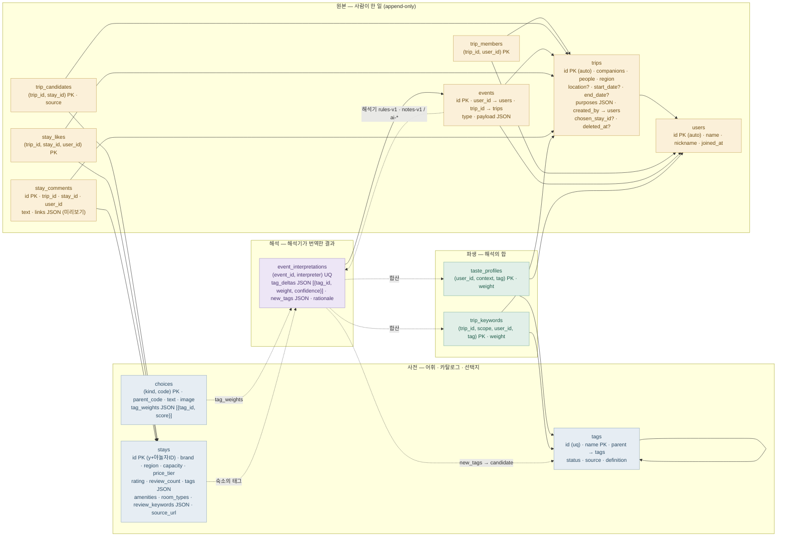

# 스키마 지도

MySQL 8 · 테이블 13개 · 네 계층. 실선은 외래키, 점선은 데이터 흐름. 예시 행은 데모 시드(`SEED_DEMO=1`)가 만든 실제 데이터다.
실행 중에는 http://localhost:8080/schema.html 에서 컬럼·FK·행 수를 실시간으로 볼 수 있다.

## 한 표의 여정 (이벤트 4)

| 단계 | 테이블 | 행 |
|---|---|---|
| 원본 | `events` #4 | 지민(2) · trip 1 · `vote` · `{"stay_id":"s04","kind":"drop","reason":"d_city","note":"서면은 너무 복잡해"}` |
| 해석 | `event_interpretations` | rules-v1 · tag_deltas: 도심상권 −1, 역세권 −1, 주방 −1, 세탁기 −1, 실속 −1, 가성비 −1 (탈락한 숙소의 특징) + 교외조용 +1, 도심상권 −2 (이유 '너무 시내라 시끄러울 듯') · rationale: "… 자유 문장 “서면은 너무 복잡해” 은 rules-v1 이 해석하지 않음 (AI 해석기 몫)." |
| 파생 | `trip_keywords` (scope=trip) | 도심상권 −3 · 교외조용 +1 · 역세권 −1 · … |
| 파생 | `taste_profiles` (지민, 커플) | 같은 값. 지민이 다음에 커플 여행을 만들면 초기 정렬에 들어간다 |

## 테이블별 역할과 맥락

### 사전 — 사람이 미리 정의한 것 (해석기와 화면이 읽는다)

| 테이블 | 무엇 | 언제 쓰이나 | 왜 따로 있나 |
|---|---|---|---|
| `tags` | 취향 어휘 트리. 최상위 5범주(입지·뷰·공간·등급·편의) 아래 자식 태그 | 취향 프로필·여행 키워드·숙소 특징이 전부 이 이름을 쓴다 | 고정 목록이면 새 취향을 못 담는다. `parent`로 분화하고 `status`(candidate→active→merged)로 해석기가 제안한 어휘를 관리하려고 |
| `stays` | 숙소 카탈로그. 야놀자 공개 페이지에서 읽은 96개(핸디즈 18) | 여행 생성 시 사전 추천, 보드의 후보·지도, 추천 점수 계산 | 특징 태그(`tags` JSON)가 어휘와 같은 이름이라 취향과 직접 대조된다. 리뷰 키워드·평점·좌표는 카드와 지도에 |
| `choices` | 화면의 모든 선택지: 취향 테스트 문항·선택지, 동행 유형, 목적, 지역, 유지/탈락 이유 | 프론트가 `/meta`로 한 번 받아 폼을 그린다. rules-v1이 `tag_weights`로 선택지를 태그 가중치로 번역 | 선택지 텍스트와 그 의미(가중치)를 코드가 아니라 데이터로 두어 문항·이유를 바꿔도 배포가 필요 없게 |

### 원본 — 사람이 한 일 (여기서만 진실이 나온다)

| 테이블 | 무엇 | 언제 쓰이나 | 왜 따로 있나 |
|---|---|---|---|
| `users` | 멤버. `name`은 초대 링크에서 입력한 이름, `nickname`은 가입 시 확정 | 헤더 선택, 멤버 체크, 근거 문장의 이름 | 테스트만 하고 간 사람(게스트)과 가입한 사람을 `joined_at`으로 구분하려고 |
| `trips` | 여행 방 = 2층 컨텍스트. 동행·인원·지역·장소·날짜·목적, 결정 숙소, 소프트 삭제 | 후보 사전 추천의 필터·가중치, 보드 머리, "묵었던 곳" 판단(`chosen_stay_id`) | 취향은 사람 단위가 아니라 사람×여행 단위로 달라지므로 여행이 학습의 단위다 |
| `trip_members` | 여행에 누가 있나 | 목록 필터(내가 멤버인 여행만), 투표·댓글 권한, 점수 합산 대상 | 초대 링크로 합류하는 흐름 때문에 여행과 멤버를 분리 |
| `trip_candidates` | 여행 후보 보드에 담긴 숙소. `source`=auto(사전 추천)·manual(멤버가 담음) | 보드의 후보 목록·지도 초록 핀 | "자동 추천된 것 vs 직접 담은 것"이 나중에 추천 품질을 재는 자료가 된다 |
| `stay_likes` | 여행×숙소 좋아요 현재 상태 | 목록 "○○이 좋아하는 숙소예요!", 점수 +5, 학습 +1 | 원본은 `events`의 like/unlike이지만 화면이 매번 접지 않도록 현재 상태를 둔다 |
| `stay_comments` | 여행×숙소 댓글 + 링크 미리보기(OpenGraph) | 상세 패널 댓글 목록 | 자유 대화(맛집 링크·이동 계획)를 숙소 옆에 두어 채팅방 분산 문제를 앱 안으로 가져오는 자리 |
| `events` | 취향을 드러내는 모든 행동의 원본. append-only, 수정·삭제 없음 | 해석기의 입력. 표 취소도 `vote_removed`로 한 줄 더 | 해석 규칙이 바뀌어도 여기서 다시 계산할 수 있어야 한다. 오늘 탈락 규칙을 바꾸고 `reinterpret` 한 번으로 전체를 다시 만든 것이 그 사례 |

### 해석 — 부품이 번역한 결과

| 테이블 | 무엇 | 언제 쓰이나 | 왜 따로 있나 |
|---|---|---|---|
| `event_interpretations` | 이벤트 하나를 해석기 하나가 태그 가중치로 번역한 결과. 근거(`evidence`)와 사람이 읽는 `rationale` 포함 | 파생 재계산의 입력, `/api/events`의 감사 화면 | 같은 이벤트에 rules-v1·notes-v1(·나중에 AI)이 나란히 행을 남기고, 어느 것을 합산할지 바꿀 수 있게 |

### 파생 — 해석의 합 (지워도 다시 만들어진다)

| 테이블 | 무엇 | 언제 쓰이나 | 왜 따로 있나 |
|---|---|---|---|
| `taste_profiles` | 유저×컨텍스트 취향. `base`는 취향 테스트, 커플·친구·가족은 그 유형 여행에서 학습 | 추천 점수의 멤버 항, 취향 패널, 다음 여행 초기 정렬 | "같은 사람도 커플 여행과 가족 여행에서 원하는 게 다르다"를 컨텍스트 키로 표현 |
| `trip_keywords` | 이 여행이 추구하는 키워드. 전체·멤버별 | 보드 키워드 패널, 점수의 "이번 선별" 항, 근거 문장 "이번 선별에서 ○○이 남긴 숙소와 같은…" | 여행 안에서 지금 배운 것과 이전 여행에서 배운 것을 분리해 보여주려고 |

## 계층별 예시 행

### 사전

`tags` — 자라는 어휘 트리

| name | parent | status | source | definition |
|---|---|---|---|---|
| 뷰 | NULL | active | seed | 창밖으로 무엇이 보이는가 |
| 바다뷰 | 뷰 | active | seed | 객실에서 바다가 보임 |
| 도심상권 | 입지 | active | seed | 번화가·상권 도보권 |
| 바다뷰/일출 | 바다뷰 | candidate | ai | (예시) AI 해석기가 제안하면 이렇게 생긴다 |

`stays`

| id | name | region | capacity | price_tier | tags |
|---|---|---|---|---|---|
| s04 | 서면 레지던스 | 부산 | 2 | 1 | ["도심상권","역세권","주방","세탁기","실속","가성비"] |
| s05 | 해운대 오션 스위트 | 부산 | 4 | 3 | ["해변","바다뷰","주방","거실","넓은객실","업스케일"] |
| s06 | 기장 바닷가 패밀리 투룸 | 부산 | 6 | 2 | ["해변","바다뷰","주방","거실","방2개이상","주차","키즈"] |

`choices` — 선택지 + 고정 가중치. `tag_weights` 는 `[{"tag_id": tags.id, "score": n}]`, 범주 규칙은 `[{"parent_id": tags.id, "score": n}]`(그 숙소의 그 범주 하위 태그에)

| kind | code | text | tag_weights |
|---|---|---|---|
| quiz_q | 2 | 창밖으로 보이면 좋겠는 것은? | NULL |
| quiz_opt | 2:1 | 바다 | [{"tag_id":11(바다뷰),"score":3},{"tag_id":8(해변),"score":2}] |
| companion | 가족 | 가족 | [{"tag_id":16(방2개이상),"score":2},{"tag_id":14(주방),"score":1},{"tag_id":23(주차),"score":1}] |
| purpose | 휴양 | 휴양 | [{"tag_id":8,"score":2},{"tag_id":11,"score":2},{"tag_id":24,"score":1}] |
| reason_keep | k_view | 뷰가 좋아서 | [{"parent_id":2(뷰),"score":2}] |
| reason_drop | d_city | 너무 시내라 시끄러울 듯 | [{"tag_id":6(도심상권),"score":-2},{"tag_id":10(교외조용),"score":1}] |

### 원본

`users`: 1 루니 · 2 지민 (둘 다 가입 완료: nickname 설정, joined_at 있음. 초대 링크로 테스트만 한 사람은 nickname NULL 인 게스트)
`trips`: 1 "10월 부산" · 커플 · 2명 · 부산 · ["휴양","맛집"] · created_by 1
`trip_members`: (1, 1), (1, 2) · `trip_candidates`: s04, s05, s06 (모두 auto)

`events`

| id | user_id | trip_id | type | payload |
|---|---|---|---|---|
| 1 | 1 | NULL | quiz_answer | {"answers":["1:1","2:2","3:1","4:1","5:1"]} |
| 2 | 2 | NULL | quiz_answer | {"answers":["1:3","2:1","3:2","4:2","5:2"]} |
| 3 | 1 | 1 | trip_created | {"companions":"커플","purposes":["휴양","맛집"],"region":"부산","people":2,"member_ids":[…],"auto_candidates":["s04","s06","s05"]} |
| 4 | 2 | 1 | vote | {"stay_id":"s04","kind":"drop","reason":"d_city","note":"서면은 너무 복잡해"} |
| 5 | 1 | 1 | vote | {"stay_id":"s05","kind":"keep","reason":"k_view","note":""} |

### 해석

`event_interpretations`

| event_id | interpreter | tag_deltas (요약) | new_tags | rationale |
|---|---|---|---|---|
| 4 | rules-v1 | 숙소 태그 6개 −1 · 교외조용 +1 · 도심상권 −2 | [] | 숙소 특징 6개에 −1, 이유 선택지 가중치 반영. 자유 문장은 rules-v1 이 해석하지 않음 (AI 몫). |
| 5 | rules-v1 | 숙소 태그 6개 +1 · 바다뷰 +2 | [] | 숙소 특징 6개에 +1, 이유 선택지 가중치 반영. |

### 파생

`taste_profiles` (지민)

| context | tag | weight |
|---|---|---|
| base | 바다뷰 | 4 |
| base | 주차 | 3 |
| base | 주방 | 3 |
| 커플 | 교외조용 | 1 |
| 커플 | 도심상권 | −3 |
| 커플 | 가성비 | −1 |

`trip_keywords` (1, scope=trip): 바다뷰 3 · 해변 1 · 거실 1 · 교외조용 1 · 넓은객실 1 · 업스케일 1 · 도심상권 −3 · …
